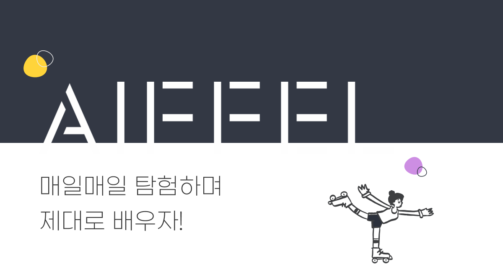

# aiffel
aiffel 1기 교육과정 정리하기

> AIFFEL : 인공지능 전문가 교육 과정

모두의 연구소와 함께하는 인공지능 전문가 양성 과정

## 풀잎 스쿨

1. Deeplearning CS231n

스탠포드의 딥러닝 강좌인 CS231n을 보며 공부

2. Coding Master

알고리즘 공부하는 풀잎스쿨

 

## Nonofficial Study

1. [Kaggle Master!](./kaggle_study/README.md)

데이터 분석 경진대회 플랫폼 케글을 통한 Data Science Insight 및 실전 경험 키우기

 

## Curriculum 

- Week 1
    - Fundamental 1 : 인공지능 개발자가 되기 위한 위대한 첫걸음
    - Fundamental 2 : 개발자를 위한 첫 번째 필수 교양
    - Fundamental 3 : [터미널로 배우는 리눅스 운영체제](./Week1/Fundamental34.md)
    - Fundamental 4 : Python으로 코딩 시작하기
    - Fundamental 5 : 머신러닝의 기본 아이디어
    - Exploration 1 : [MNIST 손글씨 분류](./Week1/Mnist-practice.ipynb), [가위바위보 분류기 만들기](./Week1/Rock-Scissor-Paper.ipynb)
    - Exploration 2 : [Iris의 품종 분류하기](./Week1/Iris-classifier.ipynb), [Scikit learn의 toy dataset을 이용해 각종 classifier 만들기](./Week1/sklearn-toy-dataset-classifier.ipynb)

- Week 2
    - Fundamental 6 : [Data 어떻게 표현하면 좋을까?](./Week2/fundamental6.md)
    - Fundamental 7 : Python으로 GUI 만들어보기
    - Fundamental 8 : [Python 잘하는 척 해보자](./Week2/fundamental8.md)
    - Fundamental 9 : 사이킷런으로 구현해보는 머신러닝
    - Fundamental 10 : 딥러닝과 신경망의 본질
    - Exploration 3 : [뉴스기사 크롤링 및 카테고리 예측 모델](./Week2/Exploration3-NewsCrawling.ipynb)
    - Exploration 4 : 거울아 거울아, 나는 멍멍이상이니 아니면 냥이상이니

- Week 3
    - Fundamental 11 : 텍스트의 다양한 변신. (문자열, 파일 다루기)
    - Fundamental 12 : 데이터를 한눈에! Visualization
    - Fundamental 13 : [가랏, 몬스터볼! 전설의 포켓몬 찾아 삼만리](./Week3/Fundamental13-Pokemon.ipynb)
    - Fundamental 14 : Tkinter로 배우는 GUI 프로그래밍
    - Fundamental 15 : 더 많이! 더 깔끔하게! 데이터를 관리하는 방법
    - Exploration 5 : [날씨 좋은 월요일 오후 세시, 자전거 타는 사람은 몇명일까?](./Week3/Exploration5(4)-bike-regression.ipynb)
    - Exploration 6 : [어제 오른 내 주식 시세, 과연 내일은?](./Week3/Exploration6(1).ipynb)

- Week 4
    - Fundamental 16 : [다양한 데이터 전처리 기법](./Week4/Fundamental16.ipynb)
    - Fundamental 17 : [그나저나 데이터는 어디서 가져오지? - 웹크롤링](./Week4/Fundamental17.ipynb)
    - Fundamental 18 : [파이썬으로 이미지 파일 다루기](./Week4/Fundamental18.ipynb)
    - Exploration 7 : [아이유팬이 좋아할만한 다른 아티스트 찾기](./Week4/Exploration7\(1\).ipynb)
    - Exploration 8 : [머신러닝 캐글 실습 - House Price Prediction](./Week4/Exploration8\(1\).ipynb)

- Week 5
    - Fundamental 19 : 확률과 확률분포
    - Fundamental 20 : [SQL을 이용해 DB와 대화해보자](./Week5/Fundamental20.ipynb)
    - Fundamental 21 : [Likelihood (MLE. MAP 개념)](./Week5/Fundamental21.ipynb)
    - Fundamental 22 : 웹앱과 배포 (Flask를 이용하여 웹앱 만들어보기)
    - Fundamental 23 : 이미지 분류기 동작 원리

- Week 6
    - Fundamental 24 : [Evaluation Metric](./Week6/Fundamental24.ipynb)
    - Fundamental 25 : [사이킷런을 활용한 추천 시스템 입문](./Week6/Fundamental25.ipynb)
    - Fundamental 26 : [TF2 API 개요](./Week6/Fundamental26.ipynb)
    - Fundamental 27 : [컴퓨터 파워 UP! (병렬프로그래밍과 동시성)](./Week6/Fundamental27.ipynb)
    - Fundamental 28 : [딥네트워크, 서로 뭐가 다른거죠?](./Week6/Fundamental28.ipynb)
    - Exploration 9 : [RNN으로 영화 리뷰 감성 분류하기](./Week6/Exploration9\(1\).ipynb)
    - Exploration 10 : [스노우스티커, 일단 한번 만들어보자!](./Week6/Exploration10\(1\).ipynb)

- Week 7
    - Fundamental 29 : 선형 대수 기초
    - Fundamental 30 : 딥러닝 레이어의 이해 (1)
    - Fundamental 31 : Gradient Descent - [여러가지 optimizer](./Week7/Fundamental31.md)
    - Fundamental 32 : 딥러닝 레이어의 이해 (2)
    - Fundamental 33 : [맵리듀스로 그리는 빅데이터 지도](./Week7/Fundamental33.ipynb)
    - Exploration 11 : [작사가 인공지능 만들기](./Week7/Exploration11\(1\).ipynb)
    - Exploration 12 : [나랑 닮은 연예인은 누구?](./Week7/Exploration12\(2\).ipynb)

- Week 8
    - Fundamental 34 : 활성화 함수의 이해
    - Fundamental 35 : 파이썬으로 이미지 파일 다루기
    - Fundamental 36 : PCA는 내친구
    - Fundamental 37 : 차원축소와 시각화
    - Fundamental 38 : Backpropagation 원리
    - Exploration 13 : Face2Emoji 모바일 웹앱 만들기
    - Exploration 14 : [인물사진을 만들어보자](./Week8/Exploration14\(1\).ipynb)

- Week 9
    - Fundamental 39 : [빅데이터 생태계](./Week8/Fundamental39\(4\).ipynb)
    - Fundamental 40 : [정보이론 톺아보기](./Week9/Fundamental40.ipynb)
    - Exploration 15 : [번역기를 만들어보자](./Week9/Exploration15\(1\).ipynb)

- Week 10
    - 해커톤!!!!!!!!

- Week 11
    - Exploration 16 : [인공지능으로 세상에 없던 새로운 패션만들기](./Week10/Exploration16\(2\).ipynb)
    - Exploration 17 : [문자를 읽을 수 있는 딥러닝](./Week10/Exploration17\(1\).ipynb)
    - Going Deeper Lec1 : [백본 네트워크 구조 상세 분석](./Week10/GoingDeeper1Lec.md)
    - Going Deeper Proj1 : [없다면 어떻게 될까? (Ablation Study)](./Week10/GoingDeeper1proj.ipynb)

- Week 12
    - Exploration 18 : [뉴스 요약봇 만들기](./Week11/Exploration18\(1\).ipynb)
    - Exploration 19 : [흐린 사진을 선명하게](./Week11/Exploration19\(1\).ipynb)
    - Going Deeper Lec2 : 잘 만든 augmentation 이미지 100장 안부럽다
    - Going Deeper Proj2 : [이미지 어디까지 우려볼까?](./Week11/GoingDeeper2proj\(1\).ipynb)

- Week 13
    - Exploration 20 : [어라? 이 시계열 이상한데? (Anomaly Detection)](./Week12/Exploration20\(2\).ipynb)
    - Exploration 21 : [트랜스포머로 만드는 대화형 챗봇](./Week12/Exploration21\(2\).ipynb)
    - Going Deeper Lec3 : Object Detection
    - Going Deeper Proj3 : GO/STOP! - Object Detection 시스템 만들기

- Week 14
    - Exploration22 : 폐렴아 기다려라 (의료 영상 기초)
    - Exploration23 : 다음에 볼 영화 예측하기
    - Going Deeper Lec4 : [물체를 분리하자! - 세그멘테이션 살펴보기](./Week13/GoingDeeper4Lec.md)
    - Going Deeper Proj4 : 도로 영역을 찾자! - 세그멘테이션 모델 만들기

- Week 15
    - Exploration 24 : 난 스케치를 할테니 너는 채색을 하거라
    - Exploration 25 : 사람이 말하는 단어를 인공지능 모델로 구분해보자
    - Going Deeper Lec5 : 너의 속이 궁금해 - Class Activation Map 살펴보기
    - Going Deeper Proj5 : 나를 찾아줘 - Class Activation Map 만들기

- Week 16